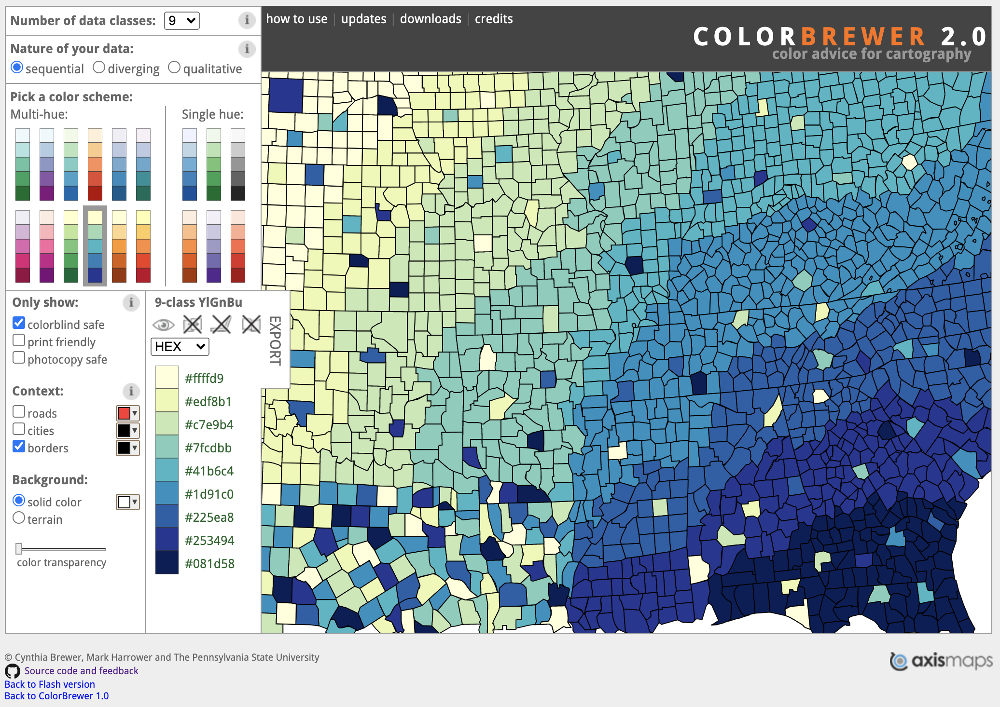

# Making Plots in R

**Summary**: *There are two basic ways to create plots in R: 1) with ggplot2 R package and 2) with base R. This chapter is divided into these two approaches, plus some helpful tips on color*

## ggplot2

The package [ggplot2](https://ggplot2.tidyverse.org/) is part of R tidyverse. It's designed to help create plots with aesthetics that make it easy to plot your data in clean and visually appealing ways. These plots are publication-ready and fairly. The main advantage of ggplot2 over base R is that it aligns the text and plot boundaries automatically so you don't have specify exactly where you want those aspects to be printed. 

The main trick with using [ggplot2](https://ggplot2.tidyverse.org/) is to get your data in the correct format. Once it's in the correct format, you can create any type of ggplot. [ggplot2](https://ggplot2.tidyverse.org/) plots perform best when data are in the ‘long’ format. The 'long' format for data has a column for every dimension and a row for every observation (or record). 

Below is an image from [Data Carpentry's R for Ecologists lesson: Manipulating, analyzing and exporting data with tidyverse](https://datacarpentry.org/R-ecology-lesson/03-dplyr.html).
[](https://datacarpentry.org/R-ecology-lesson/img/spread_data_R.png)  

Get your data into this format first. In addition to the Data Carpentry tips above, here are some additional tips:

[Converting data between wide and long format](http://www.cookbook-r.com/Manipulating_data/Converting_data_between_wide_and_long_format/) 

The main [ggplot2](https://ggplot2.tidyverse.org/) site is a great place to start to search for types of plots to apply (it includes many examples).

```{r eval=FALSE}
install.packages('ggplot2') 
library(ggplot2)
```

The [Data Carpentry R for Ecologists lesson](https://datacarpentry.org/R-ecology-lesson/index.html) has good tips on getting started with ggplot2: [Data visualization with ggplot2](https://datacarpentry.org/R-ecology-lesson/04-visualization-ggplot2.html).

We recommend learning to use [ggplot2](https://ggplot2.tidyverse.org/) for plotting data in R.

## Base R plotting


## Color on plots
Here are some great resources on color in R plots. 

Keep in mind these general rules for using color: Avoid colors that are indistinguishable by someone who is color blind. You can refer to specific HEX, RGB, or CMYK codes for specific colors.

[Colorbrewer](https://colorbrewer2.org/) is a great tool to use for selecting the type of color scheme. You can even select options for colorblind.

```{r, echo=FALSE}

```


[ggplot2 scale_brewer](https://ggplot2.tidyverse.org/reference/scale_brewer.html) includes the colorbrewer color palettes. 

[NCEAS](https://www.nceas.ucsb.edu/) has a great [cheat sheet on color in R](https://www.nceas.ucsb.edu/sites/default/files/2020-04/colorPaletteCheatsheet.pdf)

People have created lots of fun palettes to use. Here's one based on the [diversity of Maize](https://github.com/AndiKur4/MaizePal).

```{r eval=FALSE}
devtools::install_github("AndiKur4/MaizePal") 
```

## Plotting spatial data in R
R has come a long way in being able to reproduce publication-quality maps and spatial data that were historically only possible (for nice maps) with programs like ArcGIS or QGIS. We recommend using R to plot spatial data because it will be reproducible.

Here are some great resources on plotting spatial data in R:

[Making maps with R](https://geocompr.robinlovelace.net/adv-map.html) is one chapter in the larger book, [Geocomputation with R](https://geocompr.robinlovelace.net/), which is fully available online.
[](https://geocompr.robinlovelace.net/images/cover.png)  


